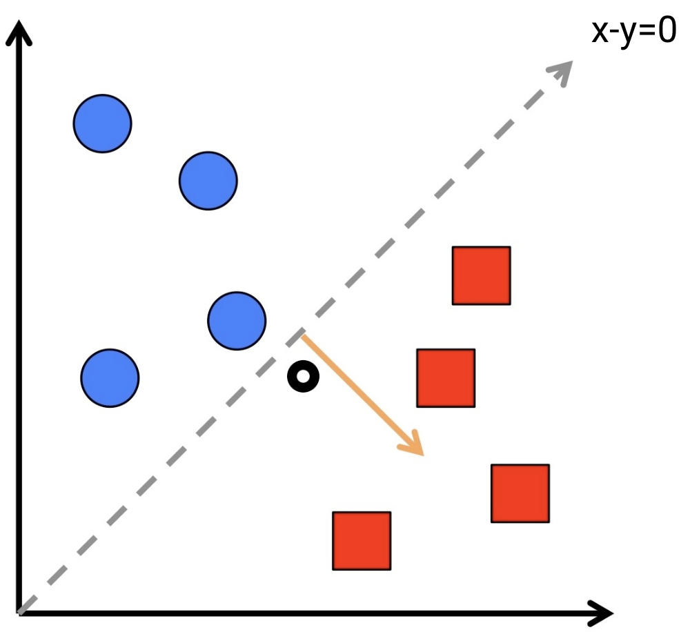
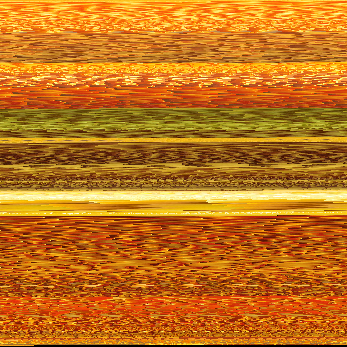

# Perceptron Machine Learning
Implementation of Perceptron machine learning algorithm in Java.

### How to Use
Clone: `git clone https://github.com/inventshah/Perceptron-ML.git`

Compile: `javac ./*.java`

Condense data: `java Condenser`

Train model: `java Perceptron`

### Condensing
Create a folder with all image targets of a certain class. The condensed image will be saved as `condensedFOLDER_NAME`.

Condensed yellow data for yellow / white distinction:

### Training
Place all training data in the `dataTraining` folder. Change the labels in the `Constants.java` to reflect the class names of the images in the `dataTraining` folder.

### Built With
* Java 13